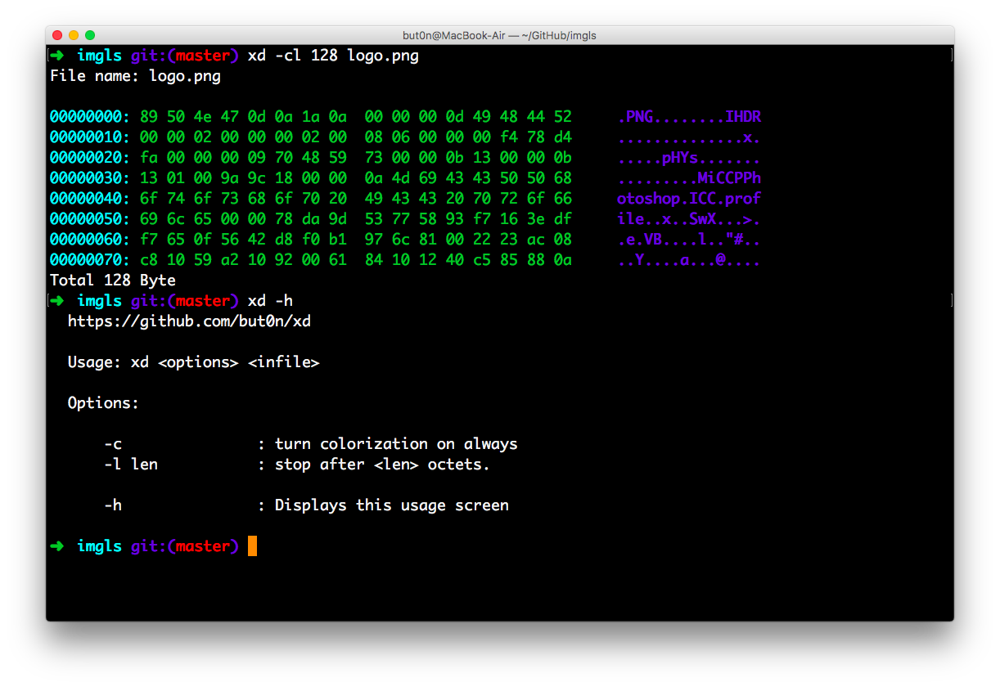

# xd



A little toy to preview a hex dump of a given file, just like xxd

```
$ make
```
 - Cross compile and launch unit test

```
$ make install
```
 - Copy this excutable file to /usr/local/bin

```
$ make uninstall
```
 - Uninstall

```
$ make clean
```
 - Clean